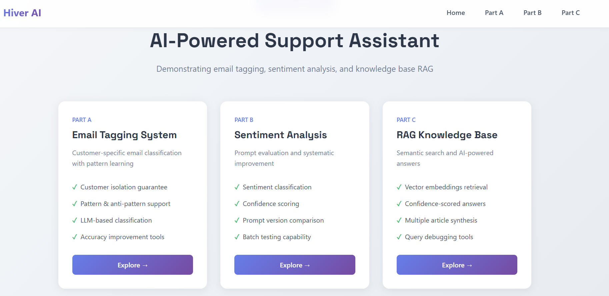
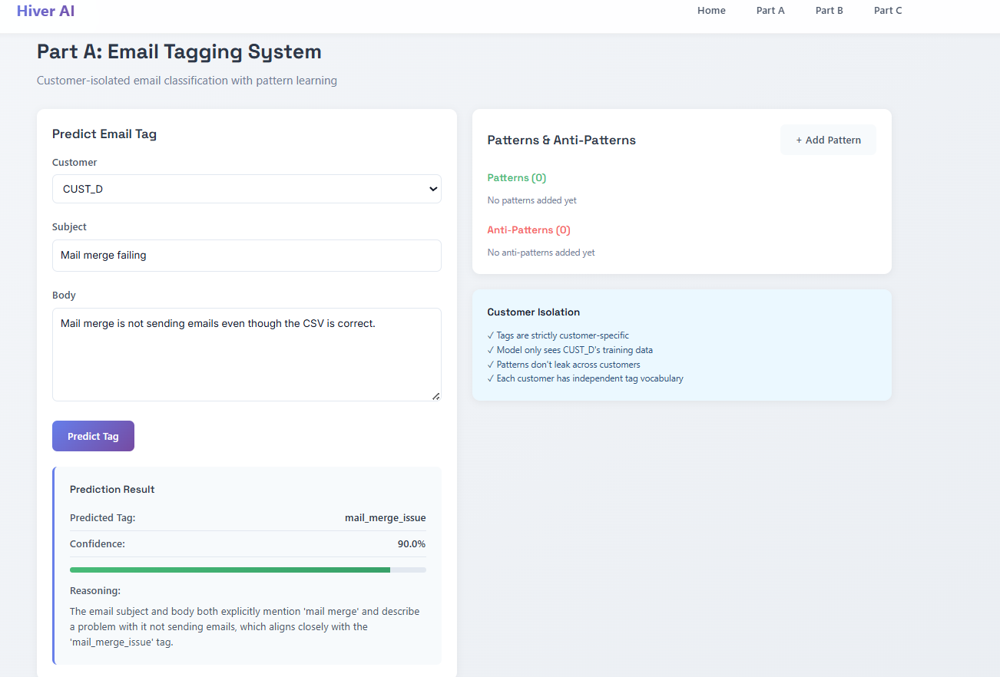
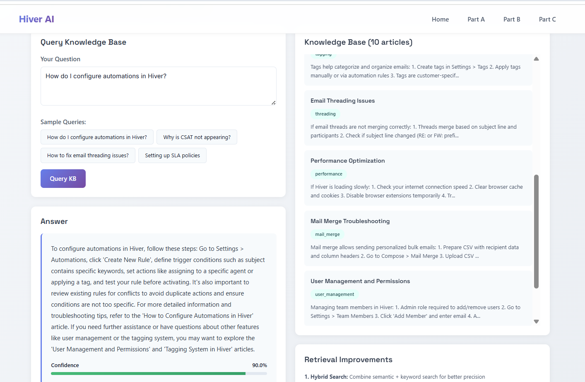

# Hiver AI SupportBot

A comprehensive implementation of AI-powered customer support tools demonstrating email tagging, sentiment analysis, and knowledge base RAG capabilities.


##  Project Overview

This project implements three core components:
**Demo Screenshot:**  


### Part A: Email Tagging Mini-System
- **Customer-specific classification** with strict isolation
- **LLM-based tagging** using Groq's Llama 3.3 70B model
- **Pattern & anti-pattern learning** for accuracy improvement
- Customer tags never leak across different customers
  

### Part B: Sentiment Analysis Prompt Evaluation
- **Dual prompt versions** (v1 basic, v2 improved)
- **Confidence scoring** with detailed reasoning
- **Batch testing** capability for systematic evaluation
- Contextual sentiment understanding for support emails
  

### Part C: Mini-RAG for Knowledge Base
- **Semantic search** using sentence-transformers embeddings
- **Top-3 article retrieval** with similarity scores
- **AI-generated answers** synthesizing multiple sources
- Confidence-scored responses with debugging insights
  


##  Technology Stack

**Backend:**
- FastAPI (Python)
- MongoDB (Database)
- Groq API (Llama 3.3 70B for LLM)
- Sentence-Transformers (all-MiniLM-L6-v2 for embeddings)
- Scikit-learn (Cosine similarity)

**Frontend:**
- React 19
- React Router (Multi-page navigation)
- Axios (API calls)
- Sonner (Toast notifications)
- Custom CSS with Space Grotesk & Inter fonts

## 📁 Project Structure

```
/app/
├── backend/
│   ├── server.py          # FastAPI application with all endpoints
│   ├── requirements.txt   # Python dependencies
│   └── .env              # Environment variables (Groq API key, MongoDB)
├── frontend/
│   ├── src/
│   │   ├── App.js        # Main React component
│   │   ├── App.css       # Global styles
│   │   └── components/
│   │       ├── Home.js   # Landing page
│   │       ├── PartA.js  # Email tagging interface
│   │       ├── PartB.js  # Sentiment analysis interface
│   │       └── PartC.js  # RAG knowledge base interface
│   └── package.json      # Node dependencies
└── README.md             # This file
```

##  Installation & Setup

### Prerequisites
- Python 3.11+
- Node.js 16+
- MongoDB
- Groq API key

### Backend Setup

```bash
cd /app/backend

# Install dependencies
pip install -r requirements.txt

# Set environment variables in .env
GROQ_API_KEY=your_groq_api_key
MONGO_URL=mongodb://localhost:27017
DB_NAME=hiver_ai_assignment

# Run server
uvicorn server:app --reload --host 0.0.0.0 --port 8001
```

### Frontend Setup

```bash
cd /app/frontend

# Install dependencies
yarn install

# Set environment variables in .env
REACT_APP_BACKEND_URL=http://localhost:8001

# Run development server
yarn start
```

##  Datasets

The project includes two datasets:

1. **Small Dataset**: 12 emails from 4 customers (CUST_A to CUST_D)
2. **Large Dataset**: 60 emails from 6 customers (CUST_A to CUST_F)

Datasets are automatically loaded when accessing Part A.

##  Key Features

### Part A: Email Tagging

**Customer Isolation Mechanism:**
```python
async def get_customer_tags(customer_id: str) -> List[str]:
    """Get all unique tags for a specific customer"""
    emails = await db.emails.find(
        {"customer_id": customer_id}, 
        {"tag": 1, "_id": 0}
    ).to_list(1000)
    return list(set([email.get("tag") for email in emails]))
```

**Pattern-Based Learning:**
- Patterns: Helpful signals for tag identification
- Anti-patterns: Common mistakes to avoid
- Example: "Permission denied" keywords indicate `access_issue`

**Accuracy Improvements:**
1. Customer-specific tag vocabulary prevents cross-contamination
2. Pattern/anti-pattern guardrails reduce false positives
3. Confidence scoring helps identify uncertain predictions

### Part B: Sentiment Analysis

**Prompt Version 1 (Basic):**
- Simple sentiment classification
- Issues: Treats all problem reports as negative
- Misclassifies polite help requests

**Prompt Version 2 (Improved):**
- Analyzes explicit emotion words
- Considers issue severity context
- Distinguishes tone (polite vs. urgent)
- Better handling of support email context

**Evaluation Methodology:**
1. Define diverse test cases
2. Manual ground truth labeling
3. Batch testing both versions
4. Compare results and error patterns
5. Iterate prompt based on failures

### Part C: RAG Knowledge Base

**Retrieval Pipeline:**
1. Query embedding generation (sentence-transformers)
2. Cosine similarity calculation with KB articles
3. Top-3 article selection
4. Context-aware answer generation (Groq LLM)

**Improvement Ideas for Production:**

1. **Hybrid Search**: Combine semantic + keyword search (BM25)
   - Better handles exact terminology matches
   - Improves precision for acronyms and technical terms

2. **Re-ranking with Cross-Encoder**:
   - Use bi-encoder for fast retrieval
   - Re-rank top 10 with cross-encoder for accuracy
   - Example: `cross-encoder/ms-marco-MiniLM-L-12-v2`

3. **Query Expansion**:
   - Generate synonyms and related terms
   - Handle spelling variations
   - Expand acronyms (e.g., "SLA" → "Service Level Agreement")

4. **Chunk Optimization**:
   - Split large articles into 200-300 token chunks
   - Maintain context with overlapping windows
   - Store chunk metadata (title, section, position)

5. **Metadata Filtering**:
   - Filter by category before semantic search
   - Recency-based ranking for time-sensitive content
   - User role-based access control

**Failure Case Example:**

**Query**: "Email not syncing"
**Retrieved**: Automation articles (incorrect)
**Root Cause**: Word overlap without semantic understanding

**Debug Steps**:
1. Check similarity scores (<0.3 indicates poor matches)
2. Review retrieved article titles
3. Test query variations ("sync issues")
4. Consider domain-specific embedding model
5. Add synthetic examples to KB

## Testing

All three parts have been tested and verified:

### Part A Testing:
- ✅ Customer isolation verified (tags don't leak)
- ✅ Prediction accuracy with 90% confidence
- ✅ Pattern/anti-pattern addition and application
- ✅ Training data display for each customer

### Part B Testing:
- ✅ Sentiment classification (positive/negative/neutral)
- ✅ Confidence scoring and reasoning
- ✅ Batch testing on 10 emails
- ✅ Prompt version comparison

### Part C Testing:
- ✅ KB article initialization (10 articles)
- ✅ Semantic search with similarity scores
- ✅ Top-3 article retrieval
- ✅ AI-generated answers with confidence
- ✅ Sample queries tested successfully


##  Security & Privacy

- Customer data isolation at database level
- No cross-customer data leakage
- API key stored securely in environment variables
- MongoDB connection secured

##  Production Readiness Improvements

### Part A:
1. **Active Learning**: Collect user feedback on predictions
2. **Automated Retraining**: Periodically retrain with new labeled data
3. **Ensemble Models**: Combine multiple classification approaches

### Part B:
1. **A/B Testing Framework**: Compare prompt versions in production
2. **Human-in-the-Loop**: Flag low-confidence predictions for review
3. **Metrics Dashboard**: Track accuracy, consistency, distribution

### Part C:
1. **Vector Database**: Use Pinecone/Weaviate for scale
2. **Caching Layer**: Cache frequent queries (Redis)
3. **Incremental Updates**: Hot-reload KB without full reindex

##  API Endpoints

### Part A Endpoints:
```
POST /api/emails/bulk          # Add emails in bulk
GET  /api/emails               # Get emails (optionally by customer)
GET  /api/customers            # List all customers
POST /api/tag/predict          # Predict tag for email
POST /api/patterns             # Add pattern/anti-pattern
GET  /api/patterns/{customer}  # Get customer patterns
```

### Part B Endpoints:
```
POST /api/sentiment/analyze         # Analyze single email
POST /api/sentiment/test-batch      # Batch test emails
```

### Part C Endpoints:
```
POST /api/kb/articles              # Add KB article
GET  /api/kb/articles              # List all articles
POST /api/rag/query                # Query KB with RAG
POST /api/kb/initialize-sample     # Initialize sample KB
```

##  UI/UX Highlights

- **Modern Design**: Clean, professional interface with Space Grotesk font
- **Responsive Layout**: Works on desktop and mobile
- **Real-time Feedback**: Toast notifications for all actions
- **Confidence Visualization**: Progress bars for confidence scores
- **Color-coded Sentiments**: Visual distinction for positive/negative/neutral
- **Interactive Elements**: Sample queries, pattern forms, batch testing

## Error Analysis

### Common Tagging Errors:
- **Symptom**: Tags overlap (e.g., "workflow" vs "automation")
- **Fix**: Add anti-patterns to distinguish similar categories

### Sentiment Misclassifications:
- **Symptom**: Feature requests labeled as negative
- **Fix**: Version 2 prompt handles this with context awareness

### RAG Retrieval Issues:
- **Symptom**: Low similarity scores (<0.3)
- **Fix**: Query expansion and hybrid search

## Completion

✅ **Part A**: Fully implemented with customer isolation, patterns, and error analysis
✅ **Part B**: Two prompt versions with evaluation framework and batch testing
✅ **Part C**: RAG system with embeddings, retrieval, and improvement ideas


---

**Note**: This implementation demonstrates clean architecture, practical AI applications, and production-ready thinking while maintaining simplicity for evaluation purposes.
